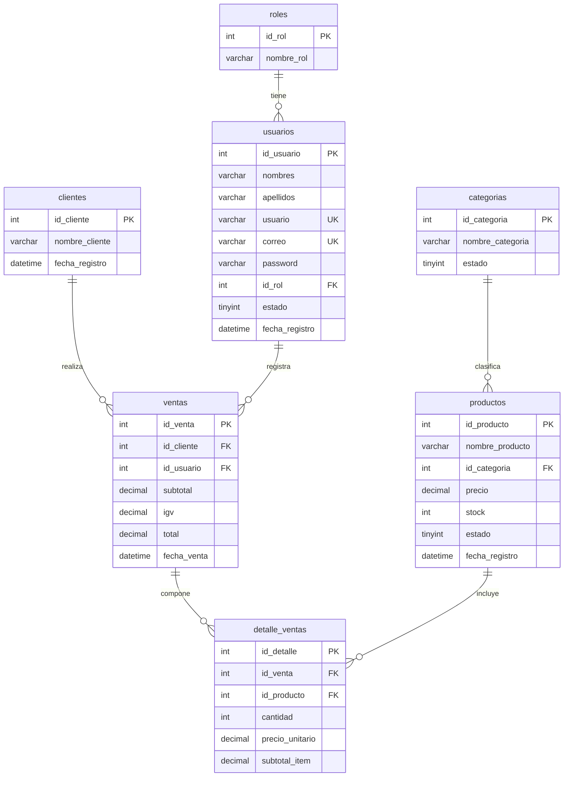

# Diagrama Entidad-Relación — Compra tu Coquito

```mermaid
erDiagram
    roles {
        int id_rol PK
        varchar nombre_rol
    }

    usuarios {
        int id_usuario PK
        varchar nombres
        varchar apellidos
        varchar usuario UK
        varchar correo UK
        varchar password
        int id_rol FK
        tinyint estado
        datetime fecha_registro
    }

    categorias {
        int id_categoria PK
        varchar nombre_categoria
        tinyint estado
    }

    productos {
        int id_producto PK
        varchar nombre_producto
        int id_categoria FK
        decimal precio
        int stock
        tinyint estado
        datetime fecha_registro
    }

    clientes {
        int id_cliente PK
        varchar nombre_cliente
        datetime fecha_registro
    }

    ventas {
        int id_venta PK
        int id_cliente FK
        int id_usuario FK
        decimal subtotal
        decimal igv
        decimal total
        datetime fecha_venta
    }

    detalle_ventas {
        int id_detalle PK
        int id_venta FK
        int id_producto FK
        int cantidad
        decimal precio_unitario
        decimal subtotal_item
    }

    roles ||--o{ usuarios : tiene
    categorias ||--o{ productos : clasifica
    clientes ||--o{ ventas : realiza
    usuarios ||--o{ ventas : registra
    ventas ||--o{ detalle_ventas : compone
    productos ||--o{ detalle_ventas : incluye
```
